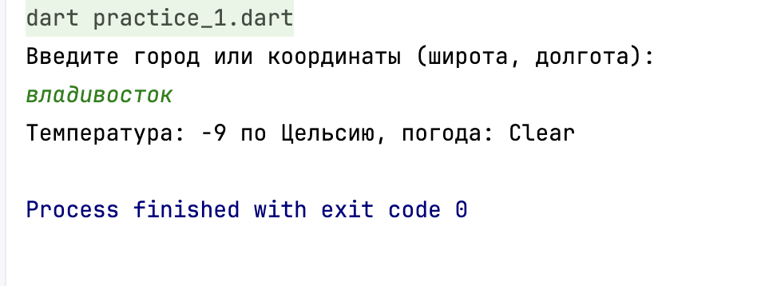
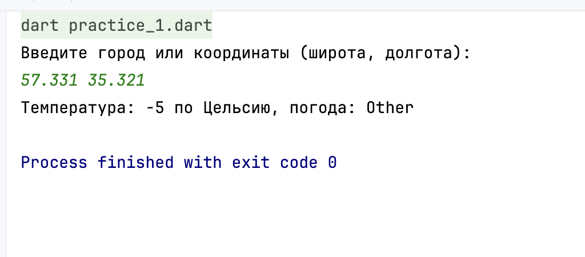
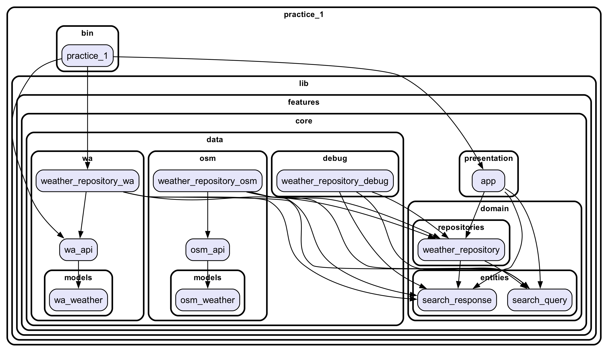

### используемое API

Приложение использует [WeatherAPI](https://www.weatherapi.com/). 

### Настройка приватного ключа для доступа к API

- В файле `bin/practice_1.dart` амените содержимое `apiKey` на Ваш приватный ключ

   ```dart
   const String apiKey = 'your_api_key_here';
   ```

### Пример работы





### Граф зависимостей


